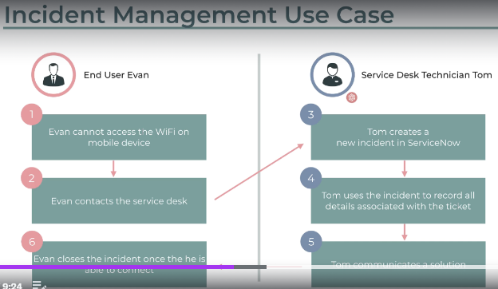
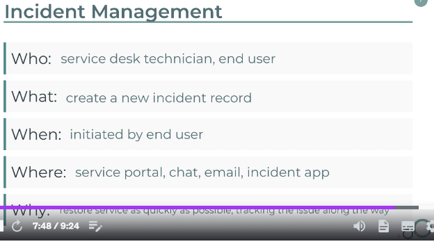
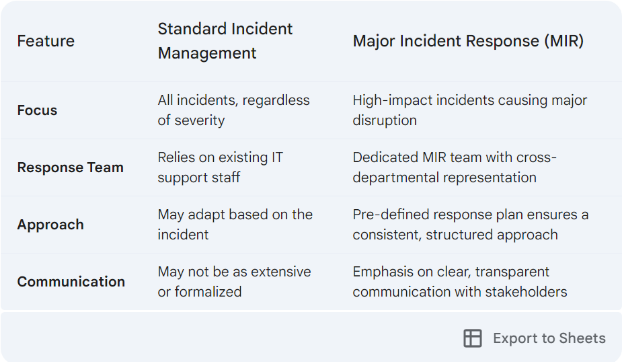
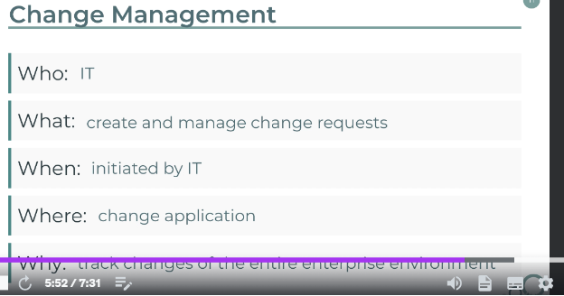
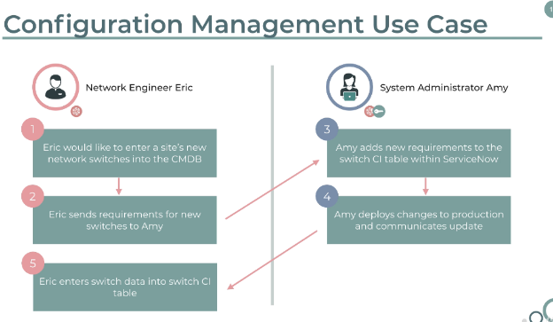
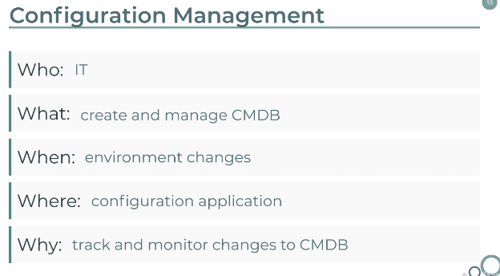
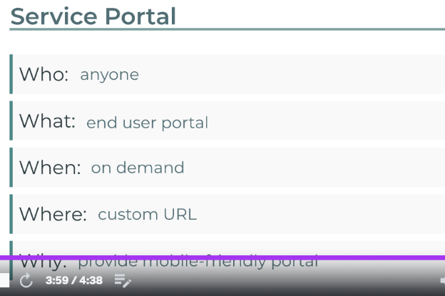
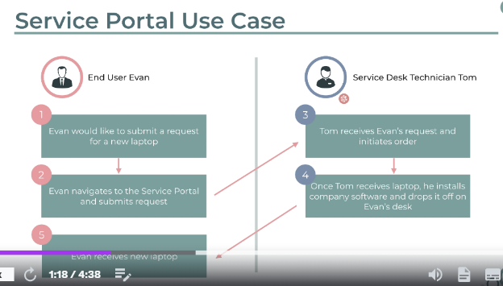

**Type of Service Now Users**

End Users 

- Has no roles and is typically in non-IT

Power Users

- Has ITIL role and is in IT

System Administrator

- Has Admin rights to the SNOW platform.

Contact Types in SNOW for End User.

- SNOW End-user view/service portal view
- Call at IT helpdesk number
- Chat 
- Email

There are typically a few common ways to open an incident ticket:

1. Self-service portal: Many organizations provide a self-service portal or knowledge base where users can log new incidents themselves. This allows users to report issues directly and start the resolution process.

2. Email/Helpdesk: Users can send an email to a designated support email address or helpdesk, which will then create a new incident ticket.

3. Phone: Users can call the support hotline or service desk and verbally report the incident. The agent will then create a new ticket on the user's behalf.

4. Chat/Messaging: Some organizations offer live chat or messaging capabilities where users can directly communicate with support agents to open new incident tickets. 

5. Mobile app: Many service management tools have mobile apps that allow users to quickly report incidents and open new tickets from their devices.

6. Monitoring tool: Automated monitoring systems can automatically detect and create incident tickets for issues detected within the IT infrastructure.

7. Monitoring team: Members of a dedicated monitoring team may also proactively open incident tickets based on alerts or observations from their monitoring tools and processes.


Contact Types in SNOW for Service Desk (Power User)

- Platform View of SNOW

**Incident management** 

Incident management is a formal process used to identify, diagnose, and resolve **unexpected disruptions** to IT services or business operations. It's essentially a structured approach to getting things back to normal as quickly as possible when something goes wrong.



**Service Desk Technician: Resolving End User WiFi Issue**

**Scenario:** An end user, Sarah Lee, reports an inability to connect to the company WiFi network.

**End User Actions:**

1. Sarah contacts the IT service desk through a preferred channel (phone, email, self-service portal).
1. She describes the issue, including any error messages or troubleshooting attempts.

**Service Desk Technician Actions:**

1. **Gather Information:** The technician asks clarifying questions to understand the problem better. These might include:
   1. Device type (laptop, phone, etc.)
   1. Specific error messages encountered (if any)
   1. Recent changes to the device or network settings
   1. Troubleshooting steps already taken
1. **Initial Diagnosis:** Based on the gathered information, the technician attempts a basic diagnosis:
   1. **Knowledge Base Search:** They check for existing solutions or troubleshooting guides in the company's knowledge base.
   1. **Account Verification:** They verify if Sarah's device is registered on the network.
1. **Resolution:** Depending on the diagnosis, the technician takes these steps:
   1. **Simple Solution:** If the issue is user-specific and easily resolved (e.g., forgetting/reconnecting to the WiFi), the technician guides Sarah through the steps.
   1. **Remote Assistance:** With Sarah's permission, the technician may remotely access her device to adjust settings or troubleshoot further.
   1. **Escalation:** If the issue is beyond their expertise or requires network changes, the technician escalates the ticket to the appropriate team (e.g., network operations).
1. **Communication:** Throughout the process, the technician keeps Sarah updated via the chosen communication channel (phone call, email updates within the ticket system, etc.).

**Resolution and Follow-up:**

- **Successful Resolution:** If the technician resolves the issue, they document the solution in the ticket for future reference. Sarah receives confirmation that the issue is fixed.
- **Escalation:** If the issue requires further investigation, the technician clarifies the next steps with Sarah, including an estimated timeframe for resolution.

**Benefits of a Service Desk System:**

- **Streamlined Process:** The system guides technicians through a consistent workflow, ensuring efficient issue resolution.
- **Centralized Communication:** All communication is documented within the ticket, improving visibility and collaboration.
- **Improved User Experience:** Clear updates keep Sarah informed of the progress, fostering a positive support experience.




Incident management deals with unplanned events that disrupt IT services or business operations. Here are some ways to categorize these incidents:

**By Impact:**

- **High Impact:** These incidents cause significant disruption to critical business functions or services, affecting a large number of users. Examples include:
  - Major system outage
  - Widespread network failure
  - Data loss event
- **Medium Impact:** These incidents disrupt some business functions or services, impacting a moderate number of users. Examples include:
  - Application slowdown
  - Printer malfunction affecting a department
  - Denial-of-service attack (DoS) causing temporary disruption
- **Low Impact:** These incidents cause minor disruptions to individual users or have minimal impact on business operations. Examples include:
  - Password reset request
  - Individual software malfunction
  - Minor website glitch

**By Urgency:**

- **Critical:** These incidents require immediate attention to prevent significant loss or damage. Examples include:
  - Security breach
  - Data loss event requiring immediate action
  - System outage impacting emergency services
- **High:** These incidents require prompt attention to minimize downtime or disruption. Examples include:
  - Major application error causing widespread issues
  - Critical system performance issue impacting core operations
- **Medium:** These incidents can be addressed within a reasonable timeframe. Examples include:
  - Minor application error affecting a small group
  - Non-critical system performance issue

**By Type of Service Affected:**

- **Hardware:** Issues related to physical devices like servers, printers, or workstations. Examples include:
  - Hardware failure causing a system outage
  - Printer malfunction halting printing operations
  - Overheated server causing performance issues
- **Software:** Problems with applications, operating systems, or other software programs. Examples include:
  - Software bug causing application crashes
  - Operating system update causing compatibility issues
  - Security vulnerability in a critical application
- **Network:** Connectivity issues, network outages, or performance problems. Examples include:
  - Internet outage affecting all users
  - Network congestion slowing down operations
  - Denial-of-service attack (DoS) targeting network resources
- **Security:** Suspicious activity, security breaches, or unauthorized access attempts. Examples include:
  - Phishing attack targeting employees
  - Malware infection compromising user data
  - Unauthorized access attempt to a critical system

MIR, or Major Incident Response, refers to a specific process within incident management that deals with high-impact events that significantly disrupt IT services or business operations. It's essentially an escalation plan for handling critical situations. Here's a breakdown of MIR:

**Purpose:**

- To ensure a swift and coordinated response to major incidents that threaten critical business functions.
- To minimize downtime, data loss, and financial impact associated with such incidents.

**Characteristics:**

- **High Impact:** Focused on incidents that cause widespread disruption or pose a significant risk to the organization. (e.g., Major system outage impacting all users, critical data breach)
- **Dedicated Team:** Often involves forming a dedicated Major Incident Response (MIR) team with representatives from various departments (IT, security, operations, management) to collaborate on resolving the issue.
- **Structured Approach:** Utilizes a pre-defined response plan outlining roles, responsibilities, communication protocols, and escalation procedures.
- **Communication & Transparency:** Effective communication with stakeholders, keeping everyone informed about the incident, progress, and estimated recovery time.

**Benefits:**

- **Faster Resolution:** Dedicated team and structured approach lead to quicker identification and resolution of major incidents.
- **Reduced Impact:** Minimizes downtime, data loss, and financial damages by responding swiftly and efficiently.
- **Improved Recovery:** Facilitates a smooth recovery process and helps get things back to normal as quickly as possible.

**Comparison with Standard Incident Management:**

While standard incident management handles all disruptions, MIR focuses specifically on critical events. Here's a table summarizing the key differences:




1. **Standard Changes:**
- **Description:** Pre-approved, low-impact, routine changes with well-defined procedures and minimal risk. Examples include adding a new user account, updating standard software versions, or replacing a failing hard drive with an identical model.
- **Process:** Often have a streamlined approval process or may even be pre-approved based on pre-defined criteria.
2. **Normal Changes:**
- **Description:** Planned changes that require a formal change request process with impact assessment and approval. These changes may have some degree of risk or require more resources compared to standard changes. Examples include installing a new software application, migrating data to a new server, or modifying network configurations.
- **Process:** Follow a defined change management workflow involving impact assessment, risk evaluation, approval by relevant stakeholders, and potentially a testing phase before deployment.
3. **Emergency Changes:**
- **Description:** Urgent changes required to address critical situations that pose a significant security risk or disruption to operations if left unaddressed. Examples include patching a critical security vulnerability, restoring a critical system outage, or taking action during a security breach.
- **Process:** Expedited approval process with limited review due to urgency. May involve higher risk due to the lack of extensive testing or impact assessment. A thorough review is still conducted after the situation stabilizes to assess effectiveness and identify lingering risks.

In addition to these main categories, some organizations might also use:

- **Major Changes:** These are significant changes with potentially high impact or risk, requiring a more comprehensive review and approval process compared to normal changes. Examples include implementing a new enterprise resource planning (ERP) system or migrating to a cloud environment.

The specific types of change requests and their categorization might vary depending on the organization's size, structure, and risk tolerance.


**Change management**

IT change management is a systematic approach **to planning, implementing, and reviewing modifications to IT infrastructure**, systems, applications, or processes. Its primary goal is to minimize disruption and risk while ensuring the successful implementation of changes.

Typically involves a defined workflow with stages like:

- **Change Request:** A formal proposal outlining the change, its purpose, and potential impact.
- **Impact Assessment:** Evaluation of potential risks and disruptions associated with the change.
- **Approval Process:** Review and authorization by relevant stakeholders based on the impact assessment.
- **Implementation & Testing:** Careful execution of the change with thorough testing to ensure functionality.
- **Deployment & Monitoring:** Deployment of the change to production and close monitoring for any issues.
- **Closure:** Documentation of the change process, lessons learned, and post-implementation review.

The main differences between standard, normal, and emergency change requests lie in their urgency, risk level, and approval process:

**Standard Change Request:**

* **Pre-approved:**  These are low-risk, routine changes that have already been reviewed and authorized by a Change Advisory Board (CAB) or similar body. 
* **Minimal Process:**  They often have a simplified approval process or may not require individual approval at all.  Some organizations may even automate standard changes.
* **Examples:** Updating software patches, adding a new user account with standard permissions, replacing aging hardware with the same model.

**Normal Change Request:**

* **Full Review:**  These are non-emergency changes that require a full assessment and approval process. 
* **Varied Risk:**  The risk level can vary from low to medium, and the impact on IT services can range from minimal to moderate.
* **Standard Process:**  They follow a defined change management process, which typically involves submitting a request, risk assessment, scheduling, and final approval from the CAB.
* **Examples:**  Installing new software, modifying network configurations, adding a new server.

**Emergency Change Request:**

* **Urgent Action:**  These are required to address critical issues that pose an immediate threat to business operations, such as security vulnerabilities or system outages. 
* **High Risk:**  They typically involve high risk and require immediate action to minimize downtime or damage. 
* **Expedited Process:**  The approval process is bypassed or significantly shortened to allow for a faster response. However, documentation and post-implementation review are still crucial.
* **Examples:**  Responding to a major security breach, restoring a critical system after a failure, implementing a hotfix for a critical bug.


Here's a table summarizing the key points:

| Feature                 | Standard Change Request | Normal Change Request | Emergency Change Request |
|-------------------------|-------------------------|-------------------------|---------------------------|
| Approval Process        | Pre-approved              | Full Review              | Expedited                |
| Risk Level               | Low                       | Low to Medium            | High                       |
| Urgency                  | Low                       | Non-urgent               | Urgent                     |
| Examples                 | Patches, User Accounts     | New Software, Network Config  | Security Breach, System Outage |


Example

Upgrading a company's customer relationship management (CRM) system.

1. **Change Request:** The IT department submits a request to upgrade the CRM system to a newer version with improved features.
1. **Impact Assessment:** The team analyzes the potential impact, including downtime for data migration and user training needs.
1. **Approval Process:** The request is reviewed by management, considering the impact and potential benefits.
1. **Implementation & Testing:** The IT team installs the new CRM system in a test environment, thoroughly testing functionality and data migration.
1. **Deployment & Monitoring:** The new CRM system is deployed to the production environment during a scheduled maintenance window. IT monitors for any issues and user adoption.
1. **Closure:** The change management process is documented, including lessons learned from testing and deployment. User feedback is collected for further improvements.
1. ------------------------------------------------------------------------------------------------------------
1. 

**Configuration Management**

Configuration management (CM) is the process of establishing and maintaining consistency in a system's attributes throughout its lifecycle. In simpler terms, it's about ensuring all the components of a system, like hardware, software, and settings, are set up and remain in the desired state.

Here's a breakdown of what CM involves:

- **Establishing a Baseline:** Defining the desired configuration for each element of the system. This includes hardware settings, software versions, security configurations, and any other relevant details.
- **Tracking Changes:** Monitoring and documenting any modifications made to the system's configuration. This ensures a clear history of changes and allows for reverting to previous states if necessary.
- **Maintaining Consistency:** Verifying that all components of the system adhere to the established baseline configuration. This helps prevent inconsistencies that might lead to malfunctions or security vulnerabilities.
- **Version Control:** Tracking different versions of the system configuration, allowing for rollbacks if issues arise after updates.

**Benefits of Configuration Management:**

- **Reduced Downtime:** By maintaining consistent configurations, CM helps prevent unexpected issues and minimizes downtime caused by inconsistencies.
- **Improved Security:** Consistent security configurations across the system minimize vulnerabilities and improve overall security posture.
- **Simplified Troubleshooting:** Documented configurations facilitate faster troubleshooting by providing a clear picture of the system's setup.
- **Enhanced Compliance:** CM helps ensure systems comply with internal policies and external regulations.
- **Improved Automation:** Standardized configurations enable automation of deployment and configuration management tasks, saving time and resources.

**Applications of Configuration Management:**

- **IT Infrastructure:** Managing configurations of servers, network devices, and other IT equipment.
- **Software Development:** Ensuring consistent configurations across development, testing, and production environments.
- **Security Management:** Maintaining consistent security configurations across all systems and devices.
- **Cloud Computing:** Managing configurations of virtual machines and cloud resources.

**Popular Configuration Management Tools:**

- Ansible
- Chef
- Puppet
- SaltStack

By implementing configuration management practices, organizations can ensure their systems are reliable, secure, and easier to manage, ultimately improving overall efficiency and reducing risks.





Service Portal

Service Portal in ServiceNow (SNOW) is a web-based interface that allows end-users (employees, customers, etc.) to self-service their IT needs. It acts as a single point of access for various IT services, resources, and functionalities.





**Snow Tutorial** 

Creating Incident 

Creating Problem

Creating Knowledge article

A problem ticket in ServiceNow, also known as a problem record, is directly tied to the concept of **problem management** within the ITIL framework.

Here's the breakdown:

* **Purpose:**  Problem tickets help identify the underlying cause of recurring incidents and service disruptions. 
* **Focus:**  Unlike incident tickets that address specific occurrences, problem tickets aim to prevent future issues by finding the root cause. 
* **Creation:** Problem tickets can be created in a few ways:
    * **From Incidents:** The service desk might identify a need for further investigation after encountering repeated incidents and initiate a problem ticket.
    * **Proactive Approach:** IT teams can proactively create problem tickets if diagnostics reveal potential problems before they cause incidents. 
* **Information:** Problem tickets typically include details like:
    * Description of the issue
    * Affected systems or services
    * Related incident records (if any)
    * Progress updates during the investigation

**Benefits of Problem Tickets:**

* **Reduced Downtime:** By addressing root causes, problem management helps prevent recurring incidents and minimizes service disruptions.
* **Improved Efficiency:**  Resolving the underlying issue prevents IT teams from wasting time fixing the same symptoms repeatedly.
* **Proactive Approach:**  Problem management enables a proactive approach to IT service management, focusing on preventing problems rather than just reacting to incidents.

**In essence, problem tickets are like detective work in ServiceNow. They help diagnose the root cause of IT troubles and prevent future headaches!**


Parent and child tickets in ServiceNow establish a hierarchical relationship between incident reports. This helps track complex issues with multiple interrelated parts.

Here's how it works:

* **Parent Ticket:** This is the main incident record representing the overarching issue. It typically captures the high-level problem affecting multiple users or services.
* **Child Ticket:** These are individual incident reports that detail specific aspects or symptoms related to the parent issue. Each child ticket focuses on a smaller piece of the puzzle contributing to the bigger problem.

**Benefits of Parent-Child Relationships:**

* **Improved Organization:**  Breaking down a complex issue into smaller, more manageable parts makes troubleshooting and resolution easier.
* **Centralized View:**  The parent ticket provides a central location for all related information, offering a complete picture of the overall problem. 
* **Streamlined Communication:**  Updates made on the parent ticket automatically cascade down to child tickets, improving communication and information flow.
* **Efficient Resolution:**  By resolving child tickets contributing to the parent issue, technicians can effectively address the root cause and close the parent ticket.

**Here's an Example:**

Imagine a network outage affecting multiple departments (parent ticket). Each department experiencing issues might have a separate child ticket detailing specific symptoms like "no internet access" or "slow email performance." Resolving these child tickets (fixing network issues) would ultimately resolve the parent ticket (network outage).

**How to Create Parent-Child Tickets:**

* You can designate an existing incident as a parent by marking the "Is Child" checkbox and selecting the relevant parent incident number.
*  Alternatively, when creating a new incident, you can specify the parent ticket during the creation process.

**Overall, parent-child ticketing in ServiceNow helps organize complex issues, streamline workflows, and expedite resolution.**


SLA For SNOW
Link - https://www.youtube.com/watch?v=vjPFVcL248s

What is SLA? 

- It is basically a set of agreements between a
service provider and customer that defige the
scope, quality and speed of the services being
provided.

SLA VS OLA VS UC

Let me explain the key differences between SLAs, OLAs, and UCs in service management:

1. SLA (Service Level Agreement)
- External agreement between a service provider and its customers
- Defines expected service quality, availability, responsibilities
- Example: "99.9% system uptime, 24-hour response time for critical issues"
- Focused on end-user experience and business outcomes

2. OLA (Operational Level Agreement)
- Internal agreement between different departments/teams within an organization
- Supports the SLA by defining how teams work together
- Example: "IT Infrastructure team will respond to Network team requests within 2 hours"
- Details specific operational metrics and responsibilities

3. UC (Underpinning Contract)
- Agreement between an organization and external third-party suppliers/vendors
- Ensures external support for delivering SLAs
- Example: "Cloud provider guarantees 99.99% infrastructure availability"
- Defines vendor obligations, penalties, and support terms

Key relationships:
- SLAs are supported by OLAs and UCs
- OLAs coordinate internal teams to meet SLA requirements
- UCs ensure external vendors provide necessary support


Configure SLA in SNOW?
https://youtu.be/vjPFVcL248s?t=189

Difference between "Response" and "Resolution" SLA?

Response and Resolution SLAs are two distinct but related metrics in service management:

Response SLA:

- Measures the time taken to initially acknowledge/respond to an incident/request
- Usually involves first contact with the customer
- Example: "High priority tickets must receive first response within 30 minutes"
- Typically includes:
  - Auto-reply confirmations
  - Initial ticket assignment
  - First human contact
  - Basic ticket categorization

Resolution SLA:
- Measures the total time taken to completely solve the issue
- Tracks from ticket creation to final resolution
- Example: "Critical incidents must be resolved within 4 hours"
- Includes:
  - Investigation time
  - Implementation of solution
  - Customer verification
  - Ticket closure

| Priority | Response Time | Resolution Time |
|----------|---------------|-----------------|
| Critical | 30 minutes    | 4 hours        |
| High     | 1 hour        | 8 hours        |
| Medium   | 4 hours       | 24 hours       |
| Low      | 8 hours       | 48 hours       |


Note: The clock may "pause" during:
- Customer response waiting time
- After-hours periods (if not 24/7 support)
- Scheduled maintenance windows

Different Stages of SLA?

Different Stages of SLA's:

•In Progress
- Achieved (can be identified through "has breached" field)
- Breached (can be identified through "has breached" field and with red filled
circle displayed in Stage field)
•Paused
•Competed
•Cancelled

Actual Elapsed Time VS Business  Elapsed Time

Let me explain the key differences between Actual Elapsed Time and Business Elapsed Time:

Actual Elapsed Time (AET):
- Also known as "Calendar Time" or "Clock Time"
- Measures time continuously (24/7/365)
- Includes ALL time periods:
  - Weekends
  - Holidays
  - After-hours
  - Lunch breaks
- Example: If a ticket is created Friday at 5 PM and resolved Monday at 9 AM
  - AET = 64 hours (includes entire weekend)

Business Elapsed Time (BET):
- Also known as "Business Hours" or "Working Hours"
- Only counts time during defined business hours
- Excludes:
  - Non-working hours
  - Weekends
  - Public holidays
  - Scheduled maintenance windows
- Example: If a ticket is created Friday at 5 PM and resolved Monday at 9 AM
  - BET = 1 hour (assuming 9 AM-5 PM business hours)
  - Only counts the 1 hour on Monday morning

Important Considerations:
1. SLAs typically use BET for calculations
2. Different support levels may have different business hours:
   - Standard: 9 AM-5 PM, Mon-Fri
   - Extended: 8 AM-8 PM, Mon-Sat
   - 24/7: AET and BET would be the same

What is "Retroactive start" in SLA's?

Link - https://www.youtube.com/watch?v=tY098MB7bTE

A Retroactive Start in SLAs refers to when the SLA clock begins counting from a time before the actual ticket creation or assignment. Here's a detailed explanation:

Definition:
- SLA timer starts counting from a point in the past
- Often used to account for system delays or customer wait times
- Can be applied to both Response and Resolution SLAs

Common Use Cases:
1. Email Delays
   - Customer sends email at 9:00 AM
   - System creates ticket at 9:15 AM
   - SLA retroactively starts at 9:00 AM

2. Phone Support
   - Customer waits in queue for 10 minutes
   - Ticket created after agent answers
   - SLA includes queue waiting time

3. System Outages
   - System goes down at 2:00 PM
   - Ticket created at 2:30 PM
   - SLA clock starts at 2:00 PM

Benefits:
- More accurate reflection of actual customer wait time
- Better measurement of true service quality
- Fairer accountability for support teams
- Helps identify system delays and bottlenecks

Example Setup:
- Ticket created: 10:30 AM
- First customer contact time: 10:15 AM
- Retroactive start applied
- SLA clock begins: 10:15 AM

Reset Condition in SLA s

Reset Conditions in SLAs are specific triggers or events that restart the SLA timer. Here's a detailed breakdown:

Common Reset Conditions:

1. Status Changes
- Pending Customer → In Progress
- Reopened ticket
- Moving from Resolved back to Active
- Escalation to different support level

2. Priority Changes
- Ticket priority updated (High → Critical)
- Severity level modification
- Impact assessment changes

3. Customer Actions
- New information provided
- Response to clarification request
- Additional requirements added
- Customer reopens closed ticket

4. Technical Scenarios
- Multiple related incidents merged
- Ticket reassignment to different team
- Major scope change
- System dependencies identified

Examples:
```
Initial Timeline:
- Ticket Created: 9:00 AM
- SLA Target: 4 hours (1:00 PM)

Reset Scenario 1 (Status Change):
- Customer sets to Pending at 10:00 AM
- Customer responds at 11:00 AM
- SLA resets, new target: 3:00 PM

Reset Scenario 2 (Priority Change):
- Priority changed from Medium to High at 10:30 AM
- SLA resets with new High priority timeline
```

Best Practices:
1. Clearly document reset conditions
2. Notify relevant parties when reset occurs
3. Track original and reset times
4. Maintain reset history for reporting

Certainly, here are some examples of incident priority levels from P1 (highest) to P5 (lowest):

P1 - Critical/Urgent:
- Complete system outage that impacts all users/customers
- Critical business function or revenue-generating service is down
- Data breach or security incident with immediate threat
- Major production issue causing significant financial or reputational damage

P2 - High:
- Severe degradation of a core business service or application
- Significant number of users unable to perform essential job functions
- Important feature or functionality not working properly
- Security vulnerability with potential for exploitation

P3 - Medium: 
- Partial service disruption affecting a subset of users
- Recurring issues with moderate business impact
- Non-critical application or service malfunctioning
- Request for a high-priority change or configuration update

P4 - Low:
- Isolated or intermittent issues with minimal business impact
- Requests for information, advice or minor enhancements
- General troubleshooting or "how-to" questions
- Issues with non-essential tools or peripherals

P5 - Minimal:
- Cosmetic problems or typos with no functional impact
- Feature requests or suggestions for future improvements
- Questions about policies, procedures or documentation
- Issues with employee-owned devices or personal applications

The specific criteria and thresholds for each priority level can vary between organizations based on their IT service management policies and business needs. The goal is to ensure the most critical incidents are addressed first to minimize disruption and impact.


Okay, let's discuss the differences between ticket ownership and resolution ownership when it comes to incident management:

Ticket Ownership:
- Refers to who is primarily responsible for managing and tracking the incident ticket itself.
- This includes things like assigning the ticket, updating its status, adding notes, and ensuring it progresses through the resolution workflow.
- The ticket owner is typically the first-line support agent or service desk personnel who receives and triages the initial incident report.
- The ticket owner acts as the central point of contact for the user and coordinates the overall incident response.

Resolution Ownership:
- Refers to who is responsible for actually resolving or fixing the underlying technical issue.
- This is typically a subject matter expert, specialist, or technical team who has the necessary skills and access to diagnose and remediate the problem.
- The resolution owner may be a different person or team than the ticket owner, especially for more complex incidents.
- The resolution owner provides updates to the ticket owner on the investigation and restoration progress.
- Ultimately, the resolution owner is accountable for fully resolving the incident to the user's satisfaction.

The key differences are:
- Ticket ownership is about managing the incident workflow, while resolution ownership is about fixing the technical problem.
- Ticket owners coordinate the overall process, while resolution owners provide the technical expertise.
- There may be a handoff or collaboration between ticket and resolution owners to fully address the incident.

Maintaining clear ownership for both the ticket and the resolution is crucial for effective incident management and ensuring timely restoration of services.

Absolutely, let's break down the key responsibilities for each of those IT service desk roles in the context of incident management:

IT Service Desk Manager:
- Oversees the overall incident management process and service desk operations
- Sets policies, procedures, and service level agreements (SLAs) for incident response
- Ensures the service desk is properly staffed, trained, and equipped to handle incidents
- Monitors incident metrics, identifies trends, and drives continuous improvement
- Communicates with IT leadership and business stakeholders on incident status and mitigation

IT Service Desk Shift Lead:
- Supervises and coordinates the work of the service desk agents during their shift
- Manages the incoming incident queue, prioritizes tickets, and assigns to agents
- Provides guidance and escalates complex issues to subject matter experts
- Monitors agent performance and provides coaching/feedback
- Communicates shift updates and responds to inquiries from stakeholders

IT Service Desk Agent:
- Acts as the first point of contact for users reporting incidents
- Logs new incident tickets, gathers details, and categorizes the issue
- Attempts to resolve incidents through basic troubleshooting and knowledge base
- Escalates unresolved or complex incidents to appropriate technical teams
- Updates ticket statuses, adds notes, and communicates resolution progress to users
- Closes tickets once the incident is fully resolved to the user's satisfaction

In summary, the manager oversees the entire incident management process, the shift lead coordinates the daily operations, and the agents handle the frontline incident response and resolution. Effective collaboration between these roles is crucial for providing efficient and high-quality incident management services.


A problem ticket is a type of incident ticket that is created to investigate and address the underlying cause of recurring or complex incidents, rather than just resolving the immediate symptoms.

The key differences between a problem ticket and a regular incident ticket are:

When to Create a Problem Ticket:
- Recurring incidents - When the same or similar incident keeps happening repeatedly
- Complex incidents - When the root cause of an incident is not easily identifiable or fixable
- Major incidents - When a high-impact incident occurs that requires in-depth analysis

Purpose of a Problem Ticket:
- Identify the root cause of the recurring or complex issue
- Implement a permanent fix or workaround to prevent future occurrences
- Improve the organization's overall resilience and service quality

Key Activities in a Problem Ticket:
- In-depth investigation and analysis of incident data and patterns
- Engaging subject matter experts and technical teams to diagnose the issue
- Testing and evaluating potential solutions or changes
- Documenting findings, risks, and recommended remediation actions
- Planning and coordinating the implementation of a permanent fix
- Validating the effectiveness of the solution through further monitoring

By creating dedicated problem tickets, the organization can move beyond just resolving individual incidents and instead focus on addressing the underlying problems. This more proactive approach helps reduce the overall incident volume and improve the stability and reliability of IT services.


