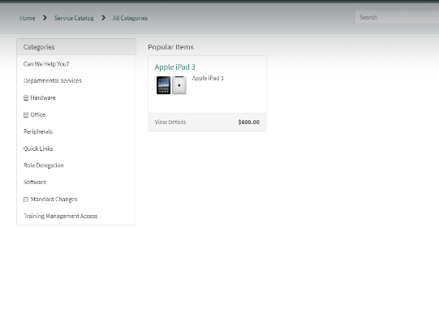

Introduction to ITSM

> \- IT Service Management - Implement, manager, and deliver the needs
> of the businesses by delivering IT solutions

Pillers of ITSM

> \- Users
>
> \- Services - Quality
>
> \- Cost

Example

Customers Reporting Incidents to the IT Support Company, then another
organization in this case ServiceNow offers an good UI to log and manage
this Incidents properly. So we get a win win solution

ITSM and its Framework

> \- ITIL – Information Technology Infrastructure library, it is a
> framework of best practice for offering IT services, developed by
> British Government that we can use to deliver IT services properly.

Steps of ITIL

Hands on SNOW

ServiceNow is a cloud-based platform that provides a range of IT service
management (ITSM) solutions. It helps organizations manage and automate
their IT services, operations, and workflows, improving efficiency and
productivity.

> \- Obtain a Personal Instance of SNOW.

Incident and Major incident management.

Major Incident

Personas

Diagram

Incident Management flow

Major Incident management

Step by step guide to creating an incident

In SNOW Go to Create New Incidents

> \- The Number is the Incident number that is automatically generated
> and stored in the DB table
>
> \- Configuration Item is related to Configuration Management Database
>
> \- New: The incident has been reported but not yet reviewed.
>
> \- In Progress: The incident is being actively worked on by the
> support team.
>
> \- On Hold: The incident is temporarily paused, often waiting for more
> information or a third-party response.
>
> \- Resolved: The incident has been addressed, and a solution has been
> implemented.
>
> \- Closed: The incident is confirmed as resolved, and no further
> action is required.

\* Priority = Impact + Urgency

After creation of the
Incident, we have 3 tabs

After filling up of the Resolution information we will resolve the
Ticket and after standard time default is 5 days the ticket will be
closed

Process for Major Incidents

> \- If the Major incidents plugin is not installed we will install it.
> Form plugins
>
> \- Remember Usually the Major Incidents have either P1 or P2 Priority
>
>  style="width:6.26805in;height:3.58819in" />- And once Multiple Users
> are facing the same issue and is not an individual Incident anymore
> and can have business-wide impact an Experienced helpdesk agent or the
> incident manager can either **propose** or **promote** this to a
> **Major** **Incident**

> \- Once you promote to the Major Incident you need to fill in the
> Reasons
>
> \- We need to fill in the work notes and business impact

Once the Incident is promoted to a Major Incident we will get a Major
Incident tab

> \- If the incident is found that it is not suitable for a major
> incident then we can demote it

Now instead of directly
promoting to a Major incident we will propose it as one

Now once again the Incident will be escalated and the state will be
proposed

Now Usually the major incidents are assigned to a different team and can
be escalated in priority’s

Once the Incident is proposed as a major incident, the Major Incident
management team can check in the candidate list

> \- Now if the incident qualifies as a major incident we can
>
> \- Promote it to a major incident else can be demoted as well.

Now let’s learn about workbench

It has two tabs

> \- Summary and communication

The summary tabs will give a complete overview of the major incident and
allows the Major Incident manager to Add CI, Child Tickets and affected
location for the same.

> \- What is a child ticket?
>
> \- P1 ticket also known as a parent ticket is worked on but in the
> meanwhile the Help Desk team attaches the same related tickets to the
> Parent Ticket for organized problem solving. The tickets which are
> attached are known as child tickets
>
> \- The communication tab is the tab form where we can share Email
> communication according to the template.

>  style="width:6.26805in;height:3.27917in" />- Setup the Email
> communication by Add in the Communication Tasks. - Define the Plan

> \- Then manager the recipients
>
> \- Save
>
> \- Now the task should appear in the view

Now you can send Email to the Concerned team’s

**Problem** **management**

Certainly! Here's an example of a problem management scenario:

**Incident** **Description:** A user reported experiencing a Blue Screen
of Death (BSOD) on their workstation. The issue persisted despite
multiple reboots.

**Initial** **Investigation:**

> 1\. **Incident** **Logging:** The incident was logged in the IT
> service management system.
>
> 2\. **Preliminary** **Checks:** Basic hardware checks were performed,
> and no issues were found.
>
> 3\. **BSOD** **Analysis:** The error codes from the BSOD were
> analyzed, indicating potential software corruption.

**Immediate** **Resolution:**

> 1\. **OS** **Reinstallation:** To quickly restore functionality, the
> operating system was reinstalled. The user's data was backed up and
> restored post-reinstallation.
>
> 2\. **System** **Monitoring:** The system was monitored for a few days
> to ensure stability.

**Root** **Cause** **Analysis:**

> 1\. **Detailed** **Investigation:** A deeper investigation was
> conducted to identify the root cause of the BSOD.
>
> 2\. **Software** **Audit:** A software audit revealed the presence of
> unauthorized software, specifically a torrent client, which was not
> compliant with the company's IT policies.
>
> 3\. **Correlation:** It was determined that the unauthorized software
> had caused system instability, leading to the BSOD.

**Permanent** **Solution:**

> 1\. **Software** **Restriction:** The unauthorized software was
> removed from the user's workstation.
>
> 2\. **Policy** **Enforcement:** A policy was implemented to restrict
> the installation of unauthorized software. This included updating the
> company's endpoint protection software to block torrent clients and
> other non-compliant applications.
>
> 3\. **User** **Education:** The user was informed about the company's
> software policies and the importance of adhering to them to prevent
> future incidents.

**Follow-Up:**

> 1\. **Monitoring:** The user's workstation was monitored for any
> further issues.
>
> 2\. **Feedback:** The user provided feedback on the resolution
> process, which was positive.

**Conclusion:** The incident was resolved by identifying and removing
the unauthorized software, and implementing measures to prevent similar
issues in the future. This proactive approach ensured system stability
and compliance with company policies.

Use Case

We have installed a new cisco WIFI router leading to faster connection
but also getting disconnected multiple times, then they called the
Service Desk and the SD would perform a workaround like Restart the
services to temporarily fix the issue.

But they continue to face the issue, then an investigation was launched
found that the router was working on a faulty channel and a Change
Request was raised to work on the change

That made the problem disappear.

>  style="width:6.26805in;height:3.50486in" />- Process Diagram
>
> \- Example

We have some incident’s open that the WIFI Router is disconnecting
frequently,

We have applied the work around to restart the router and this is a
temporary work around

But the problem manager have noticed that and will open a problem ticket
to do further RCA

>  style="width:6.26805in;height:3.84722in" />- Then Open an incident

> \- Then Open a problem ticket

> \- Fill in the information and hit **Access**
>
> \- Then Check if the affected CI\`s are added - Then Click **Confirm**
>
> \- Then as per company’s policy the configuration manager will get in
> touch with the Problem Manager to investigate further.
>
> \- As Per investigation the Problem Manager will fill out the analysis
> info with details

Then we need to fill out the
Workaround and Cause Notes Fix notes then hit Start Fix

> \- Then fill out the information in the Popup to Start the FIX
>
> \- After that monitor the issue for some time, and check if continue
> to face this issue. - If yes, we can continue to work on the issue,
> else we can **Resolve** the issue.
>
> \- If the issue Reappears, We can hit **Re-Analize** to Analyse the
> issue.

**Request** **Fulfilment**

> Request Fulfilment Process.

What the Requestor raises is a Request Ticket **REQ** or

And an **RITM** – or Requests Item is generated as per the
query/Requests and the agents work on it.

And the activities they perform are known as Tasks.

> \- Request Fulfilment

> \- Select Request Fulfilment (A Hardware Device)
>
> \- Select and Complete the Order flow

This is Creating a **RITM** against the **REQ**

Then when we open the **RITM** we will found the **SCTASK** that we need
to work on.

An **RITM** can contain multiple **SC** **TASKS**, that we need to
complete to compete the **RITM**.

As We complete one SCTACK –
The RITM will move to next stages

> \- Request Fulfilment (Access to Software).
>
> \- Visit Request Fulfilment, -\> Get access to the Software.

The REQ is created – Associated RITM is also generated

Then as per flow we need to accept or reject the Request.

**CHANGE** **MANAGEMENT**

> \- **Type** **of** **Change**
>
> In the context of IT service management and the ChangeAdvisory Board
> (CAB), changes are typically categorized into three main types:
>
> 1\. **Standard** **Changes**:
>
> o Pre-approved and low-risk changes.
>
> o Follow a well-defined process.
>
> o Examples: Routine software updates, password resets.
>
> 2\. **Normal** **Changes**:
>
> o Require assessment and approval by the CAB.

> o Vary in complexity and risk.
>
> o Examples: Implementing new software, major system upgrades.
>
> 3\. **Emergency** **Changes**:
>
> o Implemented quickly to resolve critical issues.
>
> o Often reviewed after implementation.
>
> o Examples: Fixing a security vulnerability, restoring a failed
> service.

CAB – ChangeAdvisory Board.

The Change Advisory Board (CAB) is a group of individuals responsible
for evaluating and approving changes within an organization,
particularly in IT service management. The CAB ensures that changes are
assessed for potential risks, impacts, and benefits before
implementation. This helps maintain stability and minimize disruptions
to services.

> \- The Change Management Process workflow.

> \- A change request can start form Incident, Problem, Event, or
> Proactive Monitoring.
>
> Raising a Change form the Problem Ticket
>
> \- Right Click on the Problem Ticket and hit “**Create** **Normal**
> **Change**”
>
> \- Then the Change Form appears

>  style="width:6.26805in;height:2.26111in" /> style="width:6.26805in;height:2.57222in" />- The Documents need for
> change

Then after filing the detail information we will hit “RequestApproval ”

Once the Change is approved the State will change to Scheduled

> \- Selection of Planned start and End date. - Then Hit **Implement**.
>
> \- Then once the implementation was successful, we will go to the
> **Review** Phase.
>
> \- Then will check with SD L1 and the User or L0 if the issue is
> persisting if not we will Close it.

**Raisings** **a** **Standard** **Change.**

> \- To Raise a Standard Change we need to visit the Change -\> Create
> New.
>
> \- The From there Choose “Standard Change.”

> \- Select a Template for standard change.
>
> \- The Steps remains the same, but due to the use of template the
> fields are pre-populated
>
> \- And Doesn’t Requires an Approval for the same.
>
> **CMDB** **-** **Configuration** **Management** **Database**
>
> \- What is CMDB?
>
> \- It is a database that is used by some organizations to store the
> Hardware and Software-based CIs or Configuration
>
> It also holds the information about the relationship between CI's.
>
> \- This is like a database where it will store data about some
> hardware or software, and how they are likely to link together
>
> \- Another Purpose of CMDB is Organized View of Data and the means to
> Examine data in different ways/views.

> \- The CI are also dependent on Each other.
>
> \- Easy to understand a flaws
>
> \- CI need for change and how it\`s related to other services and how
> It could impact users

Configuration Management Team

> \- Example

The HR Team Requires a DB to store Employees Data

For that we will have a Hard
Disk in a DB that Stores the data and a way for the employee to access
it.

> \- In application navigation type **configuration** and then type CI
> Class Manager then Open Hierarchy
>
> \- Now we need to create the CIs or configuration items – for this.

**Knowledge** **Management**

> \- When you call an IT Help Desk or Service Desk, if you are facing an
> issue with some applications, they usually need some specific
> knowledge to assist you.
>
> \- This knowledge is known as Knowledge Article, Knowledge Base.
>
> Example, for three different personas, once is the L0 or the user, the
> second one is the Help Desk agent, and the third is the knowledge
> manager.
>
> Knowledge Article Steps
>
> To create a Knowledge Article, we will need to
>
> \- Search the Knowledge Section of the SNOW - Click on **Knowledge**
> **Bases.**

> Then Click on **New**
>
> \- Fill the Required Field’s
>
> \- Select the Owner Now. In that case, the Owner “xxxxxxx” will be
> responsible for the Knowledge Database and can add or remove Knowledge
> Managers.
>
> \- As a hierarchy, the owner is at the top of the Knowledge Database
> and the Knowledge Managers are added by him to perform knowledge
> management.
>
> \- Adding Managers

Then fill in the required information, save, and a knowledge base is
created.

> \- Now we will create a knowledge article.

Save the knowledge article.

Usually there are multiple steps before we can publish a knowledge
article, like Draft and Published, once published the agents and end
user can view them.

> \- View the KA

Retire a Knowledge Base

> \- Republished a Retired Article.
>
> \- Now the article is again viewable in Incident view.
>
> \- End User Views the article

**Service** **Level** **Management**

This is the process of negotiating service level agreements, ensure
SLAs, OLAs, and UCs are appropriately met.

Conduct meetings with stakeholders to review the metrics,

Goal

Maintain and improve quality IT services, Monitor and Report metrics and
eradicate Poor services.

**SLA(Service** **Level** **Agreement)**

> \- Agreement between the outsourcing company and the customer,
>
> \- it is negotiable and captures the amount of time needed to deliver
> a service. - Configurable in SNOW.
>
> \- Example as a paying customer Subway expects to get IT support
> services with reasonable amount of time from Capgemini.

**OLA(Operational** **Level** **Agreement.)**

> \- It is an internal agreement within the organisation, for example
> “x” amount of time until the incident is assigned form L1 to L1.5.
>
> \- OLA\`s can be configured with per assignment groups, Priority,
> Location, and others as well.
>
> \- The Goal of OLA\`s are to deliver internal quality services
> contributing to successfully meeting SLA\`s.
>
> \- Configurable in SNOW.

**UC** **(Underpinning** **contract)**

> \- Agreements between the Service Provider and Vendor.
>
> \- Tracks the amount of time needed to deliver a piece of hardware and
> software. - Configurable in SNOW.
>
> This is like a contract between the **outsourcing** **company** and
> their **vendor** for example they need some software like a telephone
> device, a ticketing tool
>
> Or like hardware like table chair, monitor
>
> Or Services like Internet and others

Certainly! Let's break down the concepts of **Response** **SLA** and
**Resolution** **SLA**:

**Response** **SLA**

> • **Definition**: This is the agreed-upon time frame within which a
> service provider must acknowledge or respond to a customer's request
> or issue.
>
> • **Purpose**: It ensures that the customer knows their issue has been
> received and is being addressed.
>
> • **Example**: If a customer submits a support ticket, the Response
> SLA might state that the service provider must respond within 1 hour.

**Resolution** **SLA**

> • **Definition**: This is the agreed-upon time frame within which a
> service provider must resolve or fix the customer's issue.
>
> • **Purpose**: It sets expectations for how quickly the issue will be
> fully resolved.
>
> • **Example**: If a customer reports a technical problem, the
> Resolution SLA might state that the issue must be resolved within 24
> hours.

**Key** **Differences**

> • **Response** **SLA** focuses on the initial acknowledgment of the
> issue.
>
> • **Resolution** **SLA** focuses on the complete resolution of the
> issue.

Both types of SLAs are crucial for maintaining customer satisfaction and
ensuring efficient service delivery. Do you have any specific scenarios
or additional details you'd like to discuss regarding SLAs?

Creating SLA\`s

> \- In the SNOW instance search for **Sla** **Definitions** - Then
> Select it.

> \- To create a new SLA hit New
>
> \- Then Name the SLA– Like **Network** **CI** - Then Select the Type
> as SLA
>
> \- Target as Resolution - Table Select Incident
>
> \- Workflow to Default SLAWorkflow
>
> \- Then we need to select the Duration – 3 hours - And the Schedule is
> 24\*7
>
>  style="width:6.26805in;height:1.9743in" />- And the time Zone should
> be the caller's Time zone.
>
>  style="width:6.26805in;height:1.50694in" /> style="width:6.26805in;height:1.73125in" /> style="width:6.26805in;height:1.12153in" />- Then we need to put the
> Start Condition, Pause and Stop Condition
